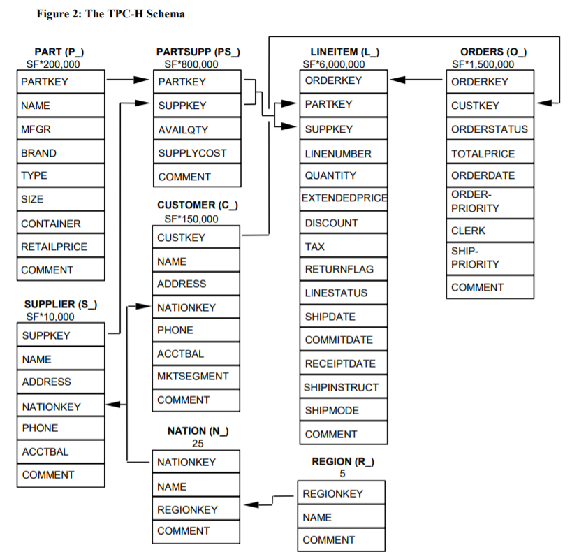

# Project 1: SQL and Python

## Description
This preliminary assignment is intended to get you started on setting up your development environment for our programming assignments, as well as to provide a refresher on programming with SQL and Python. The assignment contains two simple exercises, to demonstrate your familiarity with each.

* [Part 1](#part1): SQL Queries
* [Part 2](#part2): Python Storage Engine

### SQL Queries
Using SQL, we implement five English descriptions of queries. The dataset that we will work with comes from the TPC-H benchmark, which models the business logic needed to manage a supply chain warehouse.

#### TPC-H Database Schema

The TPC-H specification can be found [here](http://www.tpc.org/tpc_documents_current_versions/pdf/tpc-h_v2.17.1.pdf), with an ER diagram of the schema in Section 1.2 (page 13), and table definitions on Section 1.4 (page 14).

### Python Storage Engine
Using Python we will be implementing a database storage engine. This exercise is intended to get you familiar with serialization techniques in Python to help you read and write database records from a storage file. The storage engine is implemented at `dbsys_hw0/python/warmup.todo.py`
